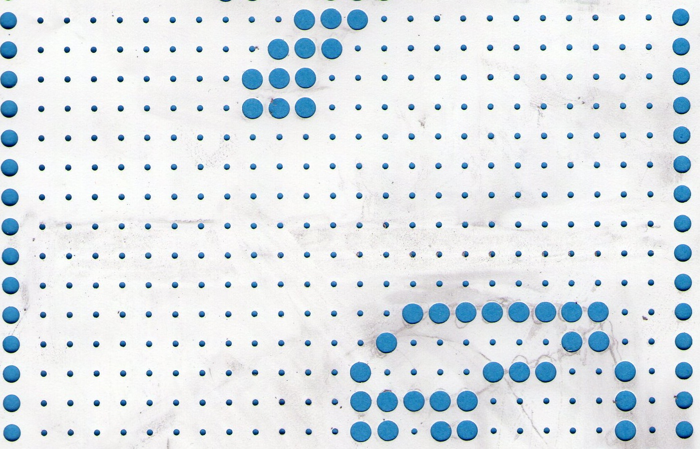
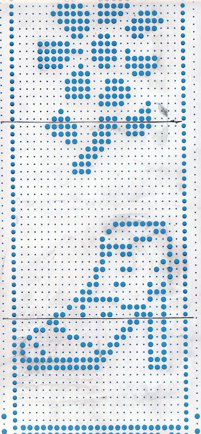
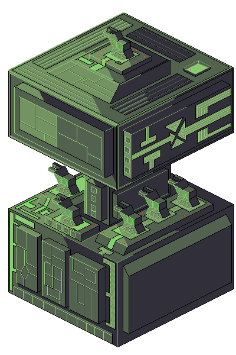
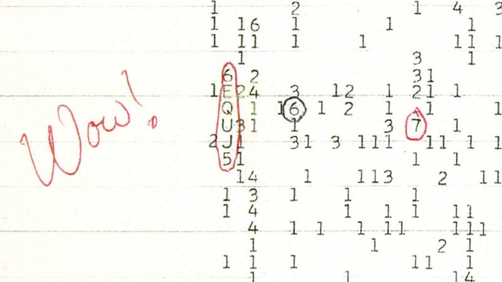
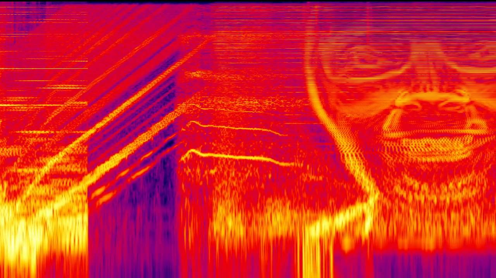
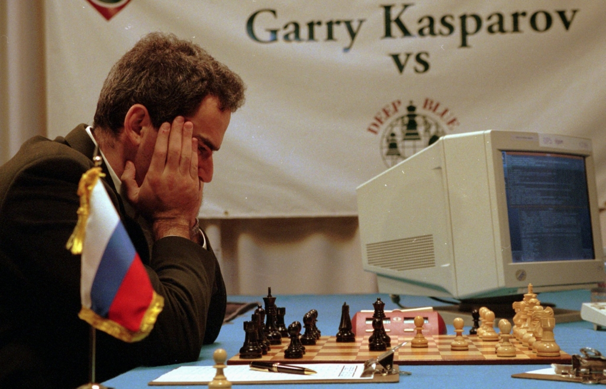
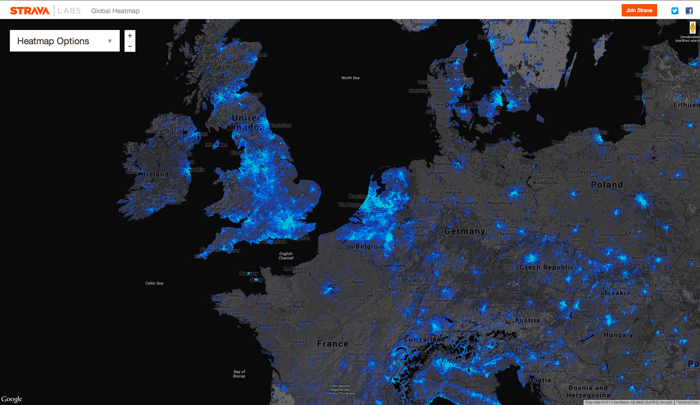
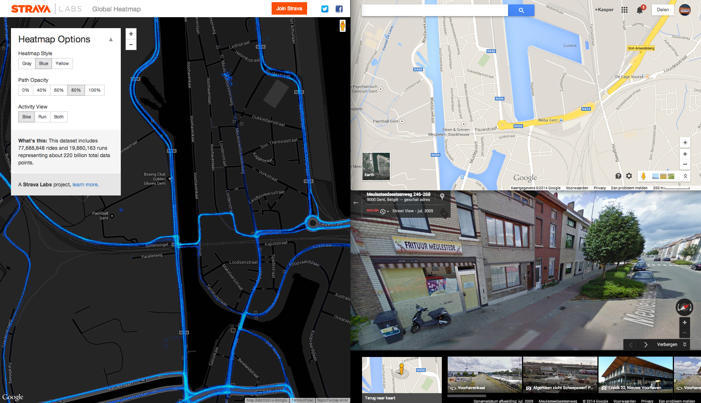
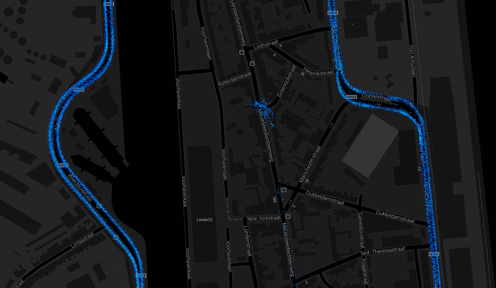

##HELLO

<aside class='notes'>researcher! NOT producer!</aside>

##data?

<aside class='notes'>is this data? yes! is this information? not yet	</aside>

#data

<aside class='notes'></aside>

#data

<aside class='notes'>data contains a story</aside>

##code
00000010101010000000000
00101000001010000000100
10001000100010010110010
10101010101010100100100
00000000000000000000000
00000000000011000000000
00000000001101000000000
00000000001101000000000
00000000010101000000000
00000000011111000000000
00000000000000000000000
11000011100011000011000
10000000000000110010000
11010001100011000011010
11111011111011111011111
00000000000000000000000
00010000000000000000010
00000000000000000000000
00001000000000000000001
11111000000000000011111
00000000000000000000000
11000011000011100011000
10000000100000000010000
11010000110001110011010
11111011111011111011111
00000000000000000000000
00010000001100000000010
00000000001100000000000
00001000001100000000001
11111000001100000011111
00000000001100000000000
00100000000100000000100
00010000001100000001000
00001100001100000010000
00000011000100001100000
00000000001100110000000
00000011000100001100000
00001100001100000010000
00010000001000000001000
00100000001100000000100
01000000001100000000100
01000000000100000001000
00100000001000000010000
00010000000000001100000
00001100000000110000000
00100011101011000000000
00100000001000000000000
00100000111110000000000
00100001011101001011011
00000010011100100111111
10111000011100000110111
00000000010100000111011
00100000010100000111111
00100000010100000110000
00100000110110000000000
00000000000000000000000
00111000001000000000000
00111010100010101010101
00111000000000101010100
00000000000000101000000
00000000111110000000000
00000011111111100000000
00001110000000111000000
00011000000000001100000
00110100000000010110000
01100110000000110011000
01000101000001010001000
01000100100010010001000
00000100010100010000000
00000100001000010000000
00000100000000010000000
00000001001010000000000
01111001111101001111000

##<h2>A long time from now, in a galaxy far far away</h2>

<h6>(src http://www.pixeljoint.com/pixelart/39566.htm)</h6>

##WOW!

(src https://seelio.com/w/aif/persuasive-essay)
<aside class='notes'>not a lot of data, big story (no computer will soon be able to reconstruct this story)</aside>

#noise vs signal

####[Spectrogram] AFX / ΔMi−1 = −∂Σn=1NDi[n][Σj∈C{i}Fji[n − 1] + Fexti[[n−1]]
<aside class='notes'>heuristic, you can 'feel' the story</aside>

##at the alien data processing farm

<aside class='notes'>get me all supercomputers so we can crack this message.. --- wrong!</aside>

##computers vs humans

######[the-chess-master-and-the-computer](http://www.nybooks.com/articles/archives/2010/feb/11/the-chess-master-and-the-computer/?pagination=false)

##computers are tools
turn them into an instrument

##data exloration instruments

##taalgrens

##pinten aan het frituur met strava op

##is daar wel een fietspad?

##other instruments in the wild

##Workshop
mediumpost
http://indiemapper.com/app/